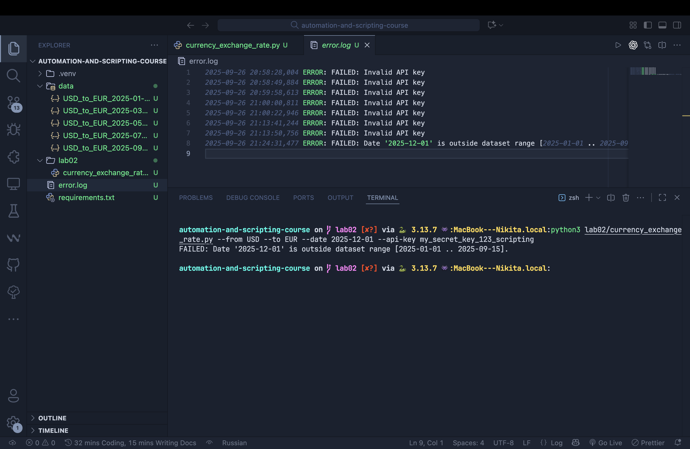
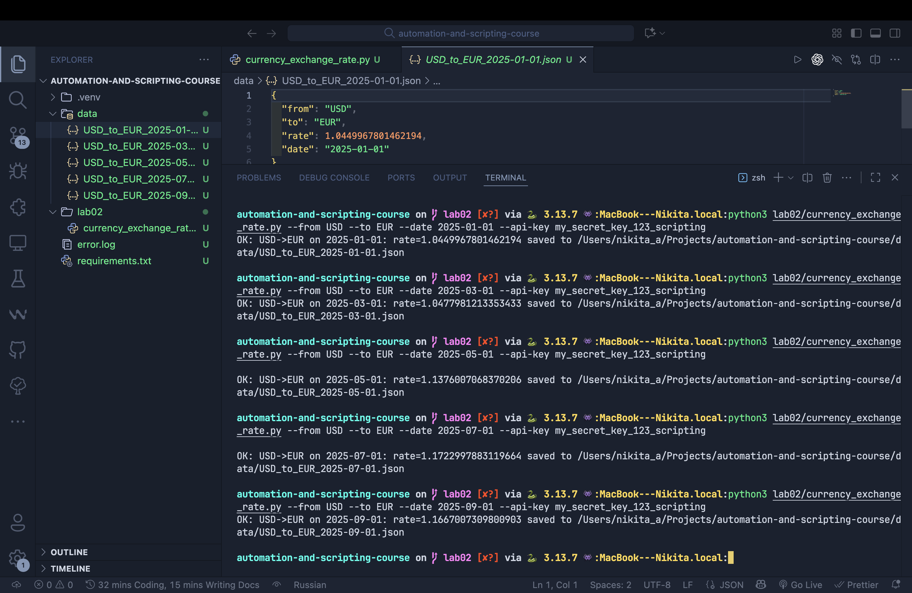
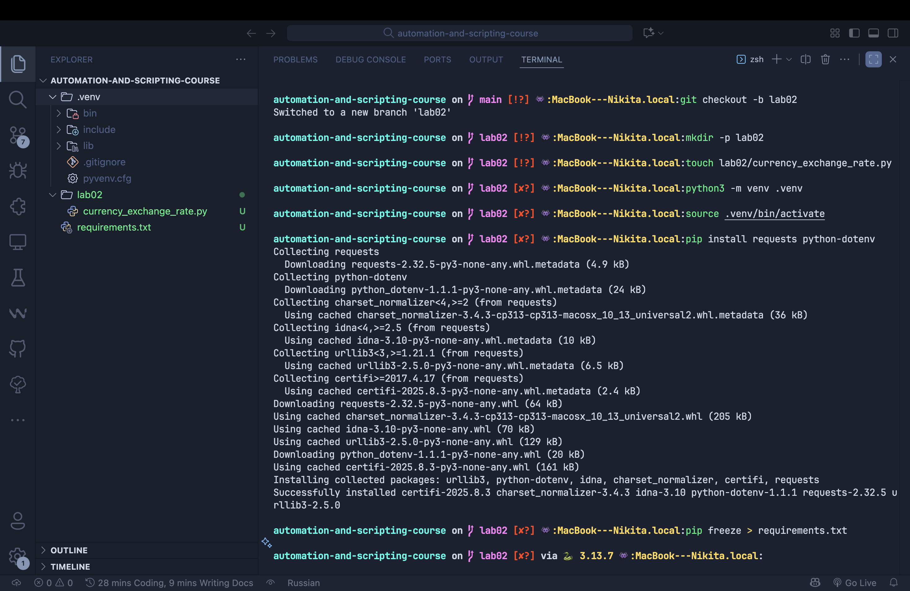
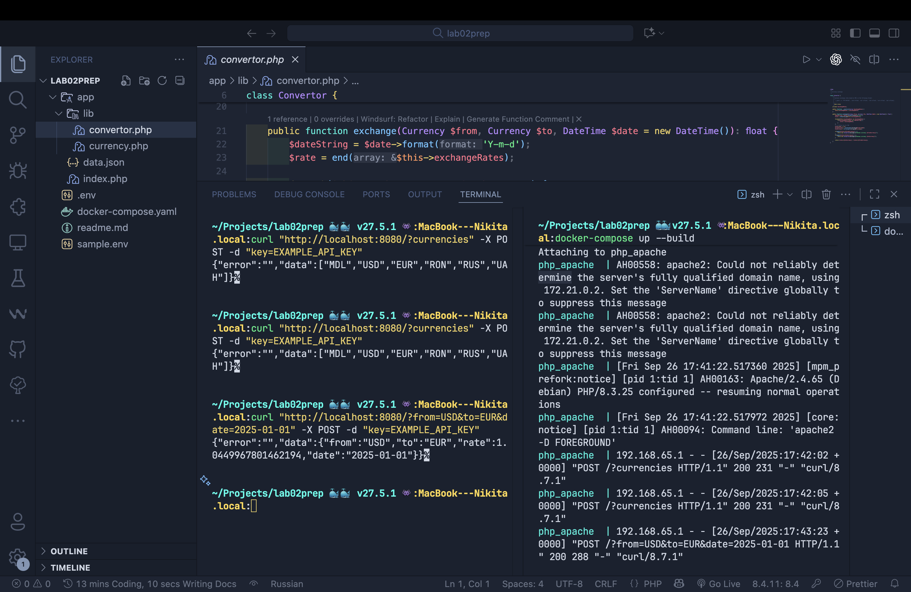
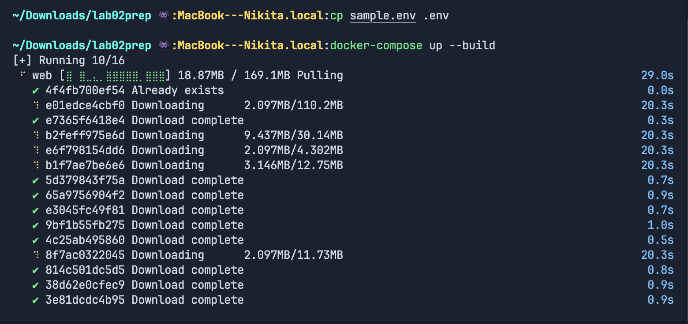

# 💱 Лабораторная работа №2

## Взаимодействие с Web API с помощью Python-скрипта (Currency Exchange Rate)

---

### Студент

- **Имя и фамилия:** Савка Никита (Savca Nichita)
- **Группа:** I2302
- **Рабочая станция:** macOS (Apple Silicon, VS Code, встроенный терминал)
- **Среда исполнения сервиса:** Docker (локально на macOS), HTTP на [`http://localhost:8080`](http://localhost:8080)
- **Среда исполнения клиента:** Python 3.11+ (локально на macOS)
- **Дата выполнения:** сентябрь 2025

---

## Цель

> Освоить практическое взаимодействие с HTTP-сервисом (Web API) из Python:  
> отправка запросов, обработка параметров и ошибок, сохранение результатов в файл, ведение лога ошибок.

---

## Суть задания

1. **В учебном репозитории создать:**
   - ветку `lab02`
   - каталог `lab02`
   - файл `lab02/currency_exchange_rate.py`
2. **Поднять сервис обменных курсов** (PHP+Apache в Docker) на [`http://localhost:8080`](http://localhost:8080).
3. **Написать Python-скрипт, который:**
   - принимает параметры командной строки:  
     `--from`, `--to`, `--date` (формата `YYYY-MM-DD`)
   - делает запрос к Web API (`GET`: from, to, date; `POST`: key=API_KEY)
   - сохраняет успешный ответ в `PROJECT_ROOT/data/to*.json` (каталог `data` создаёт при необходимости)
   - все ошибки выводит в консоль и пишет в `PROJECT_ROOT/error.log`
   - валидирует дату и коды валют; диапазон данных: `2025-01-01…2025-09-15`
4. **Протестировать скрипт** минимум на 5 датах внутри диапазона, с равными интервалами.
5. **Подготовить `readme.md`** с зависимостями, примерами запуска и краткой архитектурой.

---

## Инфраструктура и роли компонентов

| Компонент                      | Описание                                                                                                            |
| ------------------------------ | ------------------------------------------------------------------------------------------------------------------- |
| Поддерживающий сервис (Docker) | Отвечает на HTTP-запросы, возвращает JSON с курсами. Требует API-ключ через POST. Данные: 2025-01-01…2025-09-15.    |
| Python-скрипт                  | Клиент: формирует запрос, отправляет на `http://localhost:8080`, обрабатывает ответ/ошибки, пишет JSON и error.log. |
| Репозиторий                    | Хранит исходники скрипта и вспомогательные файлы.                                                                   |

---

## Подготовка поддерживающего сервиса (локально на macOS)

```bash
# 1. Перейти в каталог поддерживающего проекта (где docker-compose.yml, app/, sample.env)
cp sample.env .env
# 2. Отредактировать .env:
#    API_KEY=my_secret_key_123_scripting
# 3. Запустить сервис:
docker-compose up --build
```

- После запуска сервис доступен на [`http://localhost:8080`](http://localhost:8080).

**Быстрый самотест сервиса:**

```bash
# Список валют:
curl "http://localhost:8080/?currencies" -X POST -d "key=my_secret_key_123_scripting"

# Единичный курс:
curl "http://localhost:8080/?from=USD&to=EUR&date=2025-03-01" -X POST -d "key=my_secret_key_123_scripting"
```

---

## Подготовка учебного репозитория и Python-окружения

```bash
git checkout -b lab02
mkdir -p lab02
touch lab02/currency_exchange_rate.py

# (Рекомендую) создать виртуальное окружение Python:
python3 -m venv .venv
source .venv/bin/activate

# Установить зависимости:
pip install requests python-dotenv
pip freeze > requirements.txt
```

> Каталог `data` создавать вручную не нужно скрипт сделает это сам.

---

## Сценарий работы скрипта

- Скрипт парсит аргументы CLI: `--from`, `--to`, `--date`, `--api-key` (опционально), `--base-url` (опционально; по умолчанию `http://localhost:8080/`).
- Если `--api-key` не передан, берёт ключ из переменной окружения `API_KEY`.
- Делает запрос за списком валют (`/?currencies`) для валидации кодов (или использует fallback-набор валют).
- Валидирует коды (3 заглавные буквы) и дату (YYYY-MM-DD) плюс диапазон (2025-01-01…2025-09-15).
- Запрашивает курс: `GET` from/to/date, `POST` key. При ошибке сервиса (поле error) бросает исключение.
- Успешный ответ сохраняет в `PROJECT_ROOT/data/to*.json` (UTF-8, красивый формат).
- Любую ошибку печатает в stderr и пишет строку в `PROJECT_ROOT/error.log` с меткой времени и уровнем ERROR.

---

## Ключевые особенности реализации

- **Явная валидация** входных параметров ещё до HTTP-запроса: формат валюты и даты, границы доступного периода.
- **Чёткое разделение функций:** загрузка ключа, получение списка валют, запрос курса, сохранение JSON, настройка логгера и т. п.
- **Рабочие пути:**
  - `PROJECT_ROOT` — на уровень выше lab02 (корень учебного репозитория)
  - `DATA_DIR` — `PROJECT_ROOT/data`
  - `ERROR_LOG` — `PROJECT_ROOT/error.log`
- **Безопасность:** скрипт не пишет и не читает ничего вне своего корня; ошибки фиксируются в одном месте (`error.log`).
- **Расширяемость:** ключ можно передать через `--api-key` или через переменную окружения; базовый URL можно переопределить флагом `--base-url`.

---

## Примеры команд запуска на 5 датах

> Перед запуском: убедиться, что Docker-сервис работает и в его `.env` установлен `API_KEY=my_secret_key_123_scripting`

```bash
python3 lab02/currency_exchange_rate.py --from USD --to EUR --date 2025-01-01 --api-key my_secret_key_123_scripting
python3 lab02/currency_exchange_rate.py --from USD --to EUR --date 2025-03-01 --api-key my_secret_key_123_scripting
python3 lab02/currency_exchange_rate.py --from USD --to EUR --date 2025-05-01 --api-key my_secret_key_123_scripting
python3 lab02/currency_exchange_rate.py --from USD --to EUR --date 2025-07-01 --api-key my_secret_key_123_scripting
python3 lab02/currency_exchange_rate.py --from USD --to EUR --date 2025-09-01 --api-key my_secret_key_123_scripting
```

---

## Ожидаемое поведение при успешных запусках

- В консоли:
  ```
  OK: USD->EUR on 2025-05-01: rate=… saved to …/data/USD_to_EUR_2025-05-01.json
  ```
- В каталоге `data/` появится 5 файлов:
  ```
  data/USD_to_EUR_2025-01-01.json
  data/USD_to_EUR_2025-03-01.json
  data/USD_to_EUR_2025-05-01.json
  data/USD_to_EUR_2025-07-01.json
  data/USD_to_EUR_2025-09-01.json
  ```
- Пример содержимого JSON:
  ```json
  {
  	"from": "USD",
  	"to": "EUR",
  	"rate": 1.17,
  	"date": "2025-05-01"
  }
  ```

---

## Примеры ошибок и обработка

- **Неверный ключ API:**  
  Сервис вернёт `error="Invalid API key"` или `API key is missing`; скрипт напечатает FAILED и добавит запись в error.log.
- **Валюта вне списка:**  
  Валидация скрипта упадёт до запроса; сообщение в консоль и в error.log.
- **Неверный формат даты:**  
  Валидация даты в скрипте, ошибка в консоль и в error.log.
- **Дата вне диапазона:**  
  Скрипт осознанно отклонит, чтобы не делать пустые запросы, и запишет ошибку.
- **Сетевой сбой:**  
  Исключение requests будет отражено как FAILED и записано в error.log.

> Примечание: ошибки не создают JSON-файлы в data, чтобы не путать проверяющего.

---

## Git-операции

```bash
git add lab02/currency_exchange_rate.py requirements.txt lab02/readme.md
git commit -m "lab02: add currency_exchange_rate client and docs"
git push -u origin lab02
```

---

## Блок для скриншотов

| №   | Описание                                                                                                                                                                                                                                                                                      | Путь к изображению            |
| --- | --------------------------------------------------------------------------------------------------------------------------------------------------------------------------------------------------------------------------------------------------------------------------------------------- | ----------------------------- |
| 1   | Ошибочный запрос к скрипту (пример: неверная дата/валюта или неправильный ключ). Демонстрация обработки ошибки — сообщение FAILED в консоли и запись в error.log.                                                                                                                             |  |
| 2   | Серия из 5 успешных запусков на разных датах + листинг каталога data и содержимое одного JSON-файла (cat). Видно 5 команд с ключом, файлы в data/ и корректный JSON.                                                                                                                          |    |
| 3   | Подготовка ветки и окружения: git checkout -b lab02; mkdir lab02; touch lab02/currency_exchange_rate.py; python3 -m venv .venv; source .venv/bin/activate; pip install requests python-dotenv; pip freeze > requirements.txt. Подтверждает корректную инициализацию ветки и Python-окружения. |    |
| 4   | Запуск сервиса и проверка: в одном терминале docker-compose up --build (логи Apache/PHP), во втором — curl запросы к /?currencies и к курсу на конкретную дату. Демонстрация, что сервис поднят и отвечает корректно.                                                                         |     |
| 5   | Подготовка .env и запуск Docker: cp sample.env .env; правка API_KEY; docker-compose up --build. Подтверждает корректную конфигурацию и старт контейнеров.                                                                                                                                     |   |

---
