# Лабораторная работа №4

## Jenkins для автоматизации DevOps-задач: установка, SSH-агент и CI/CD pipeline

---

### Студент

- **Имя и фамилия:** Савка Никита (Savca Nichita)
- **Группа:** I2302
- **Рабочая станция:** macOS (Apple Silicon), VS Code, встроенный терминал
- **Среда исполнения:** Docker Desktop (локально на macOS)
- **Jenkins Web UI:** [http://localhost:8080](http://localhost:8080)
- **Дата выполнения:** ноябрь 2025

---

## Цель

> Освоить конфигурирование Jenkins для DevOps-задач:  
> поднять контроллер, подключить SSH-агент, настроить и запустить декларативный Jenkins Pipeline (CI/CD) с метками и этапами «установка зависимостей» и «тесты».

---

## Суть задания

- [x] Создать папку `lab04/` в учебном репозитории и разместить все файлы ЛР внутри неё
- [x] Поднять Jenkins Controller в Docker (`jenkins/jenkins:lts`)
- [x] Подготовить SSH-агент на базе `jenkins/ssh-agent` (добавить php-cli)
- [x] Сгенерировать SSH-ключи, передать публичный ключ агенту через `.env`, приватный — зарегистрировать в Jenkins Credentials
- [x] Создать Permanent Agent `ssh-agent1` с лейблом `php-agent`, запуск через SSH
- [x] Создать Pipeline (`Jenkinsfile`) и выполнить сборку
- [x] Подготовить readme.md с описанием проекта и ответами на вопросы

---

## Архитектура и роли компонентов

| Компонент             | Роль                                                                                           |
| --------------------- | ---------------------------------------------------------------------------------------------- |
| Jenkins Controller    | Веб-интерфейс, оркестрация билдов, хранение конфигураций, управление агентами                  |
| SSH Agent (контейнер) | Исполнитель задач. Подключение по SSH. Содержит php-cli (и при необходимости Composer/PHPUnit) |
| Docker Compose        | Описывает сервисы, сети, тома и переменные окружения                                           |
| GitHub Repo           | Хранит lab04/ с docker-compose.yml, Dockerfile, .env, Jenkinsfile и инструкциями               |

---

## Подготовка репозитория и окружения

```bash
git checkout -b lab04
mkdir lab04
```

> Ветка `lab04` — изолирует работу. Все файлы ЛР4 — в каталоге `lab04/`.

---

## Docker Compose: Controller + Agent (`lab04/docker-compose.yml`)

```yaml
services:
  jenkins-controller:
    image: jenkins/jenkins:lts
    container_name: jenkins-controller
    ports:
      - "8080:8080" # Web UI Jenkins
      - "50000:50000" # JNLP
    volumes:
      - jenkins_home:/var/jenkins_home
    networks:
      - jenkins-network

  ssh-agent:
    build:
      context: .
      dockerfile: Dockerfile
    container_name: ssh-agent
    environment:
      - JENKINS_AGENT_SSH_PUBKEY=${JENKINS_AGENT_SSH_PUBKEY}
    volumes:
      - jenkins_agent_volume:/home/jenkins/agent
    depends_on:
      - jenkins-controller
    networks:
      - jenkins-network

volumes:
  jenkins_home:
  jenkins_agent_volume:

networks:
  jenkins-network:
    driver: bridge
```

---

## Dockerfile агента (`lab04/Dockerfile`)

```dockerfile
FROM jenkins/ssh-agent

# Минимум для PHP-проектов: php-cli и git
RUN apt-get update && \
    apt-get install -y --no-install-recommends php-cli git && \
    rm -rf /var/lib/apt/lists/*
```

---

## Переменные окружения (`lab04/.env`)

```env
JENKINS_AGENT_SSH_PUBKEY=ssh-ed25519 AAAA... публичный_ключ ... jenkins_agent_ssh_key
```

---

## Запуск Jenkins Controller

```bash
cd lab04
docker compose up -d jenkins-controller
docker exec -it jenkins-controller bash -lc 'cat /var/jenkins_home/secrets/initialAdminPassword'
```

- Открыть [http://localhost:8080](http://localhost:8080)
- Ввести initialAdminPassword
- Install suggested plugins, создать администратора

---

## Подготовка SSH-ключей и SSH-агента

```bash
mkdir -p lab04/secrets
cd lab04/secrets
ssh-keygen -t ed25519 -f jenkins_agent_ssh_key -N ""
```

- Публичный: `jenkins_agent_ssh_key.pub`
- Приватный: `jenkins_agent_ssh_key`
- Публичный ключ — в `.env`, приватный — в Jenkins Credentials

---

## Сборка и запуск агента

```bash
cd lab04
docker compose build ssh-agent
docker compose up -d ssh-agent
docker compose ps
```

---

## Регистрация ключей и добавление узла в Jenkins

1. **Credentials (приватный ключ):**
   - Manage Jenkins → Manage Credentials → (global) → Add Credentials
   - Kind: SSH Username with private key
   - Username: `jenkins`
   - Private Key: Enter directly ( содержимое `jenkins_agent_ssh_key`)
   - ID: `ssh-key-jenkins-agent`
2. **Permanent Agent:**
   - Manage Jenkins → Manage Nodes and Clouds → New Node
   - Name: `ssh-agent1`
   - Type: Permanent Agent
   - Labels: `php-agent`
   - Remote root directory: `/home/jenkins/agent`
   - Launch method: Launch agents via SSH
   - Host: `ssh-agent`
   - Credentials: ключ `jenkins`
   - Host Key Verification Strategy: Non verifying

---

## Jenkins Pipeline (`lab04/Jenkinsfile`)

```groovy
pipeline {
  agent { label 'php-agent' }
  options { timestamps() }
  stages {
    stage('Install Dependencies') {
      steps {
        echo 'Preparing project...'
      }
    }
    stage('Test') {
      steps {
        echo 'Running tests...'
      }
    }
  }
  post {
    always { echo 'Pipeline completed.' }
    success { echo 'All stages completed successfully!' }
    failure { echo 'Errors detected in the pipeline.' }
  }
}
```

---

## Создание задания

- **Pipeline script from SCM**:
  - New Item → Pipeline
  - Repository URL: `https://github.com/<аккаунт>/<репо>.git`
  - Script Path: `lab04/Jenkinsfile`
  - Save → Build Now

---

## Верификация

- Контроллер доступен на :8080, плагин SSH Agents установлен
- Узел `ssh-agent1` Online, лейбл `php-agent`
- Pipeline стартует на агенте, выводит этапы и пост-секции

---

## Частые проблемы и решения

- **Ошибка декларативного синтаксиса:**  
  Все команды должны быть внутри `steps { ... }`
- **Агент не коннектится по SSH:**  
  Проверить Host, Credentials, стратегию host key verification, сеть
- **Нет Composer/PHPUnit:**  
  Добавить установку в steps или собрать кастомный образ
- **Права на тома:**  
  При необходимости задать `user: "1000:1000"` для агента
- **Apple Silicon:**  
  Используемые образы мультиархитектурные
- **Порт 8080 занят:**  
  Изменить маппинг, например, на `"8081:8080"`

---

## Ответы на вопросы

1. **Преимущества Jenkins для DevOps-автоматизации**

   - Зрелая экосистема и плагины (SCM, артефакты, уведомления, секреты, агенты)
   - Декларативные pipelines (код в репозитории, прозрачные ревью)
   - Масштабирование через динамические/облачные агенты (Docker, Kubernetes)
   - Гибкая модель прав и кредов, изолированные агенты, «pull»-модель через SSH/JNLP

2. **Какие ещё бывают агенты Jenkins**

   - SSH Build Agents — простой и надёжный способ
   - Inbound (JNLP) Agents — агент сам подключается к контроллеру
   - Docker Agents — ephemeral-контейнер на каждый билд
   - Kubernetes Agents — pod-шаблоны в K8s (масштабируемость)
   - Cloud-агенты (EC2, Azure, GCE) — автосоздание/удаление VM под нагрузку
   - Static/On-prem — выделенные машины под тяжёлые сборки

3. **С какими проблемами столкнулся и как решил**
   - Ошибка декларативного синтаксиса — переписал Jenkinsfile строго в декларативном стиле
   - Агент оффлайн — проверил Host, креды, стратегию host key verification, сеть
   - Отсутствие Composer/PHPUnit — добавил установку в Install Dependencies/Test
   - Конфликт порта 8080 — сменил маппинг

---

## Git-операции

```bash
git add .
git commit -m "lab04: Jenkins controller + SSH agent + pipeline (php-agent)"
git push -u origin lab04
```

---

## Блок с скриншотами

| №   | Описание                                   | Скриншот(ы)                                                                      |
| --- | ------------------------------------------ | -------------------------------------------------------------------------------- |
| 1   | Дерево проекта (lab04/, ветка lab04)       | 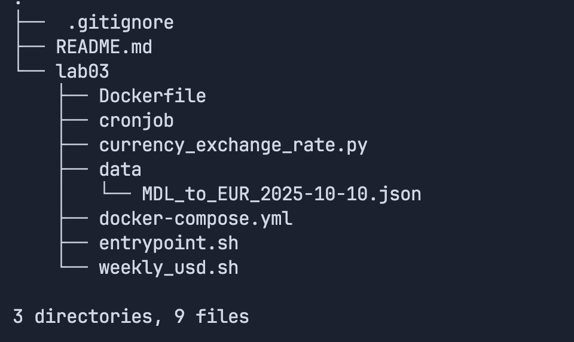                                               |
| 2   | docker-compose.yml открыт в редакторе      | 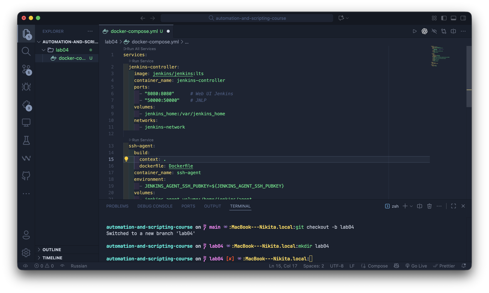                                         |
| 3   | Dockerfile агента открыт в редакторе       | 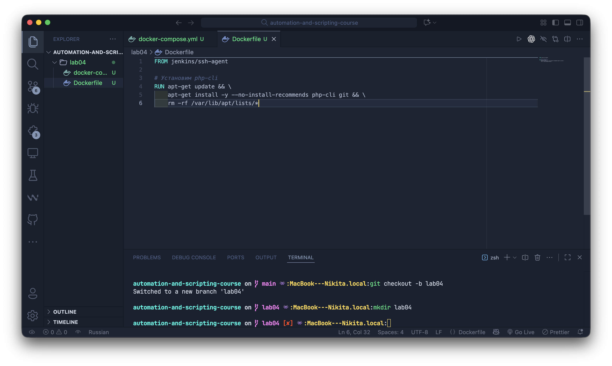                                   |
| 4   | Jenkinsfile открыт в редакторе             | 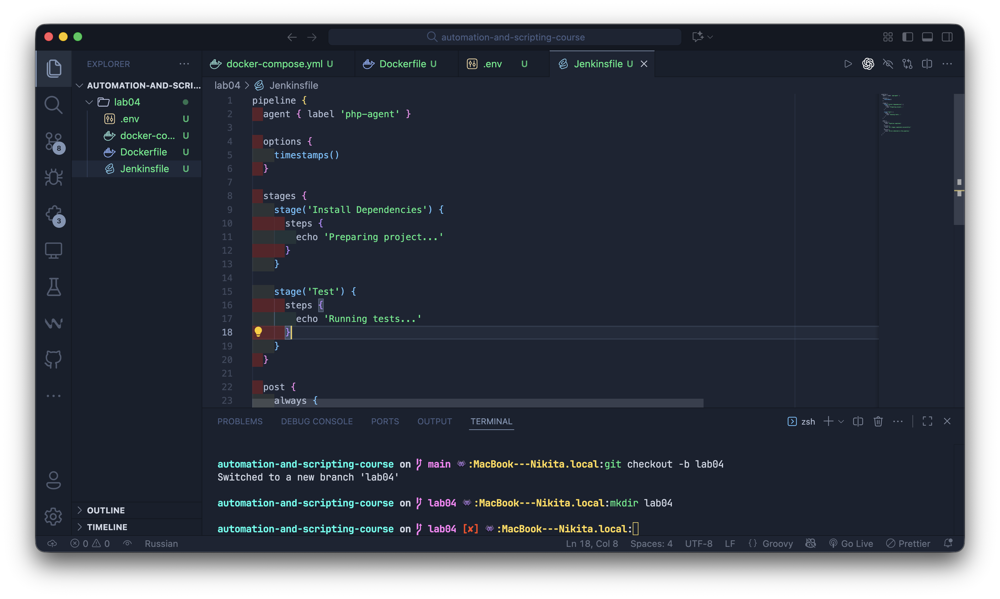                                 |
| 5   | Экран ввода initialAdminPassword           | 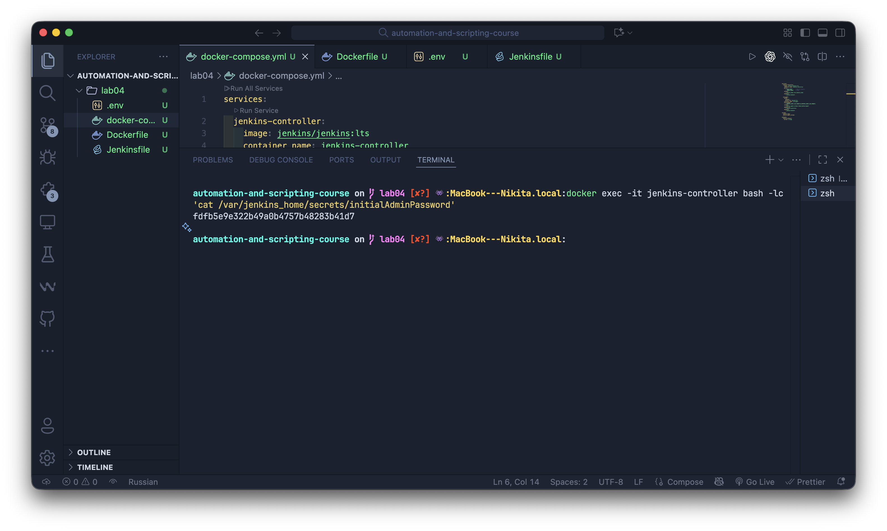                                     |
| 6   | Установленные плагины / «Jenkins is ready» | 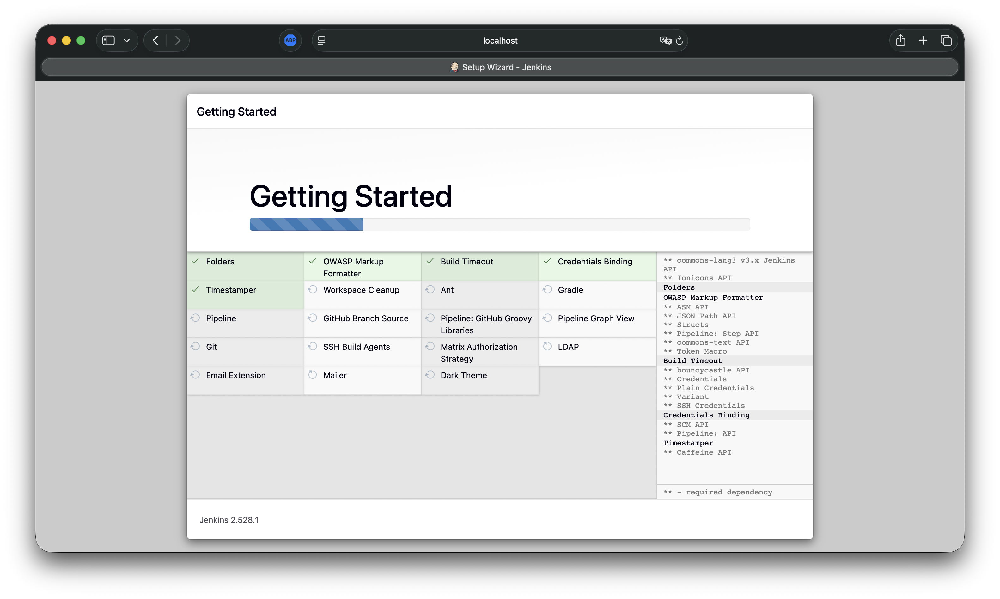<br>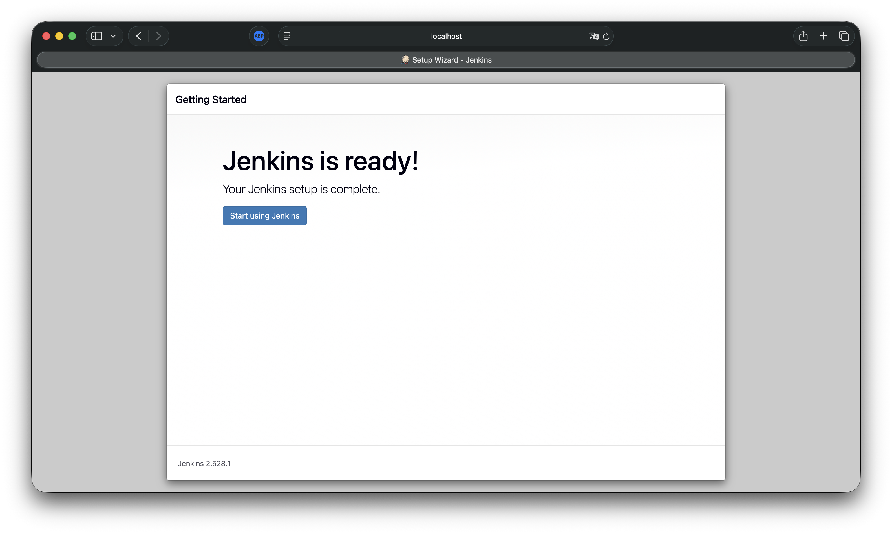 |
| 7   | Генерация SSH-ключей                       | 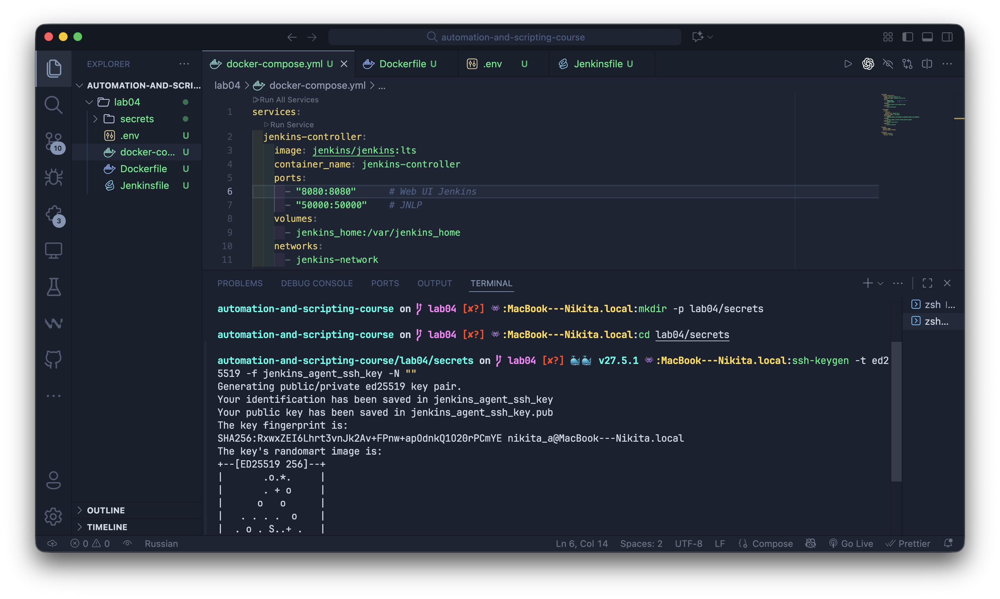                                               |
| 8   | docker compose ps (оба контейнера Up)      | 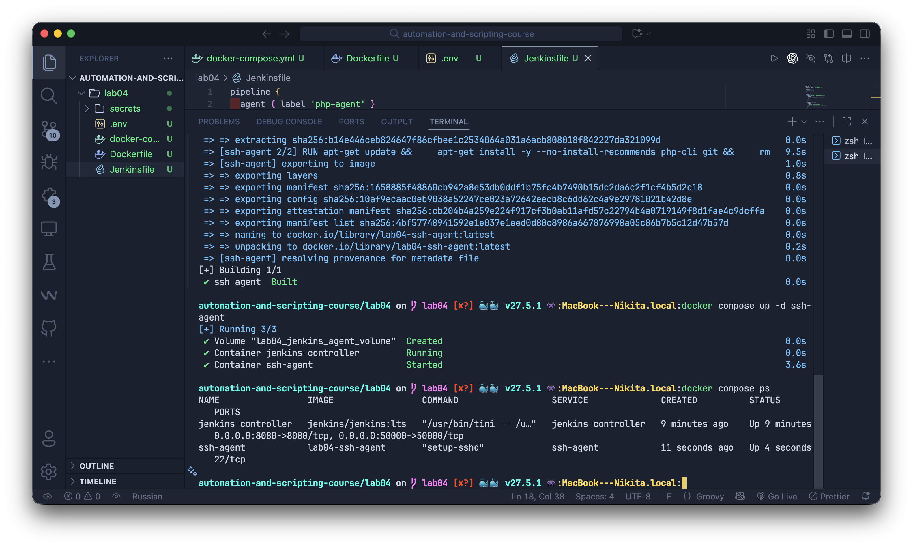                                                   |
| 9   | Добавление SSH Credentials                 | 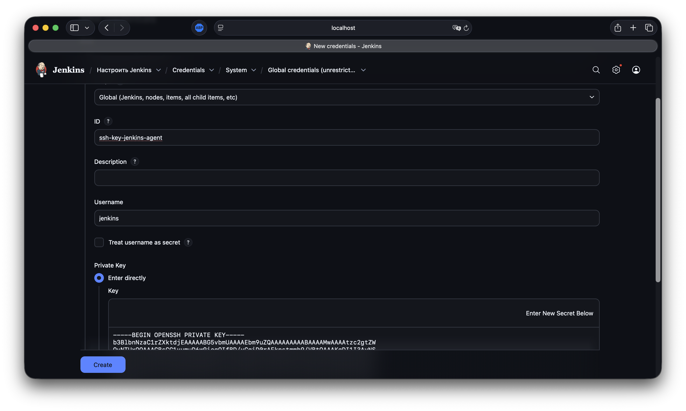                                             |
| 10  | Узел ssh-agent1 Online                     | 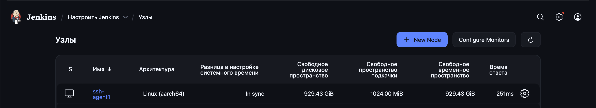                               |
| 11  | Консоль успешного билда pipeline           | 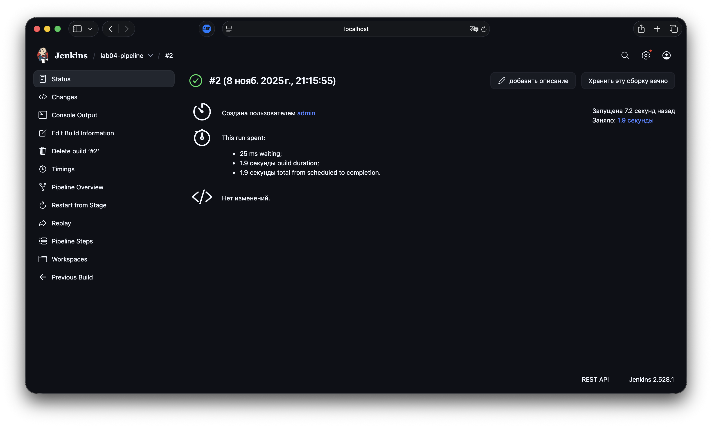                                             |

---

## Выводы

1. Развёрнут Jenkins Controller и подключён SSH-агент с лейблом `php-agent`
2. Настроен Jenkins Pipeline (декларативный), этапы исполняются на агенте
3. Описана типовая интеграция PHP-проекта (Composer/PHPUnit)
4. Приведены рекомендации по безопасности, обновлениям и бэкапам

---
