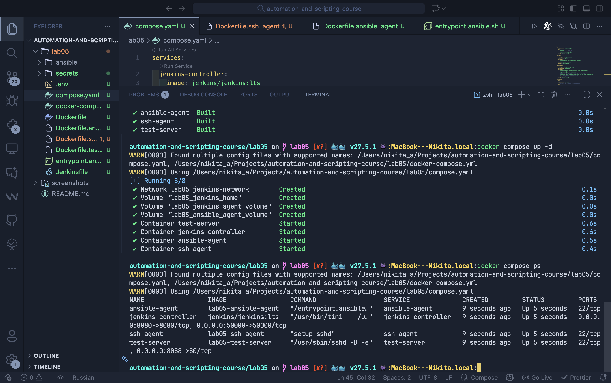
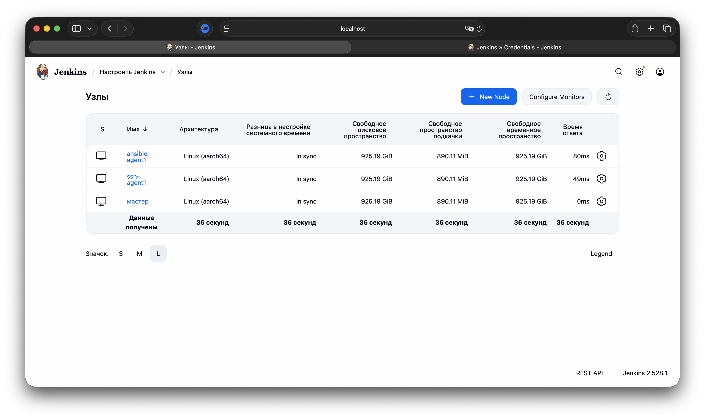
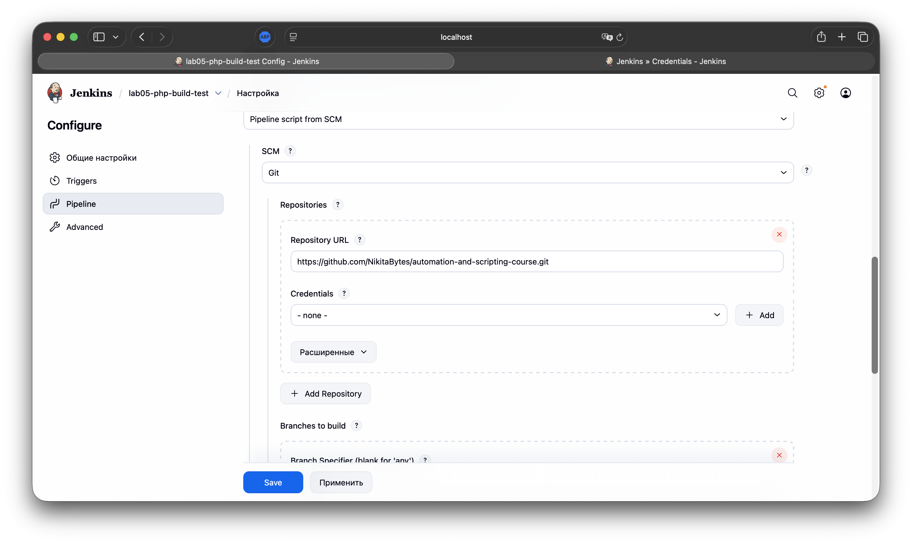
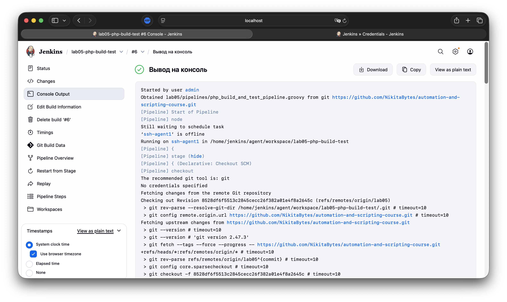
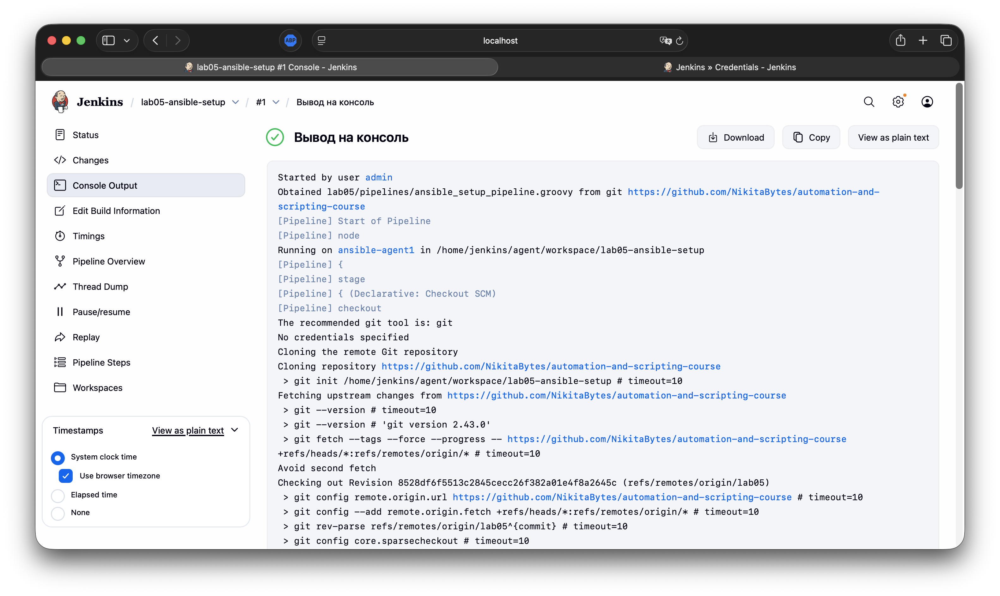
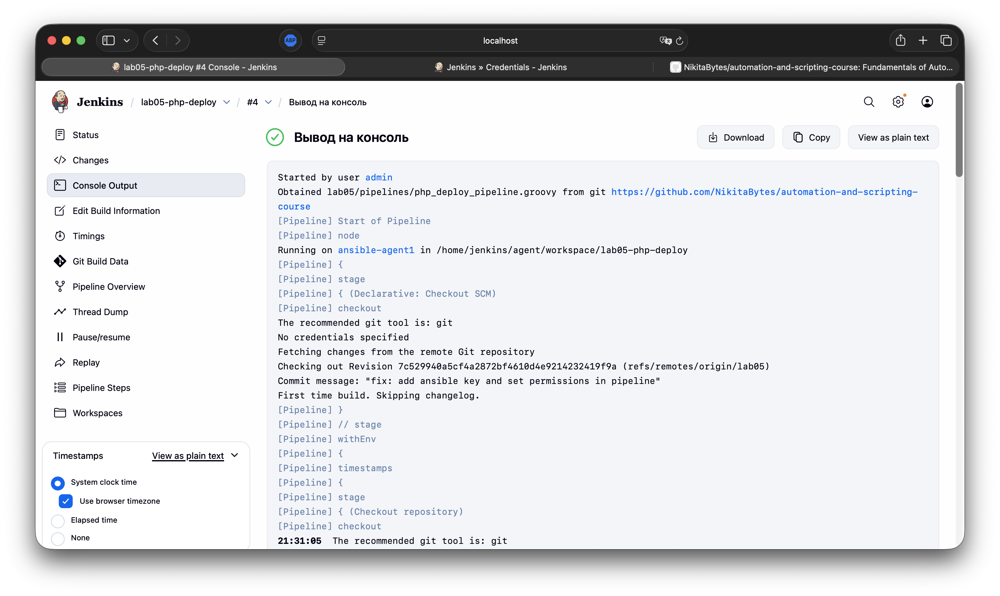
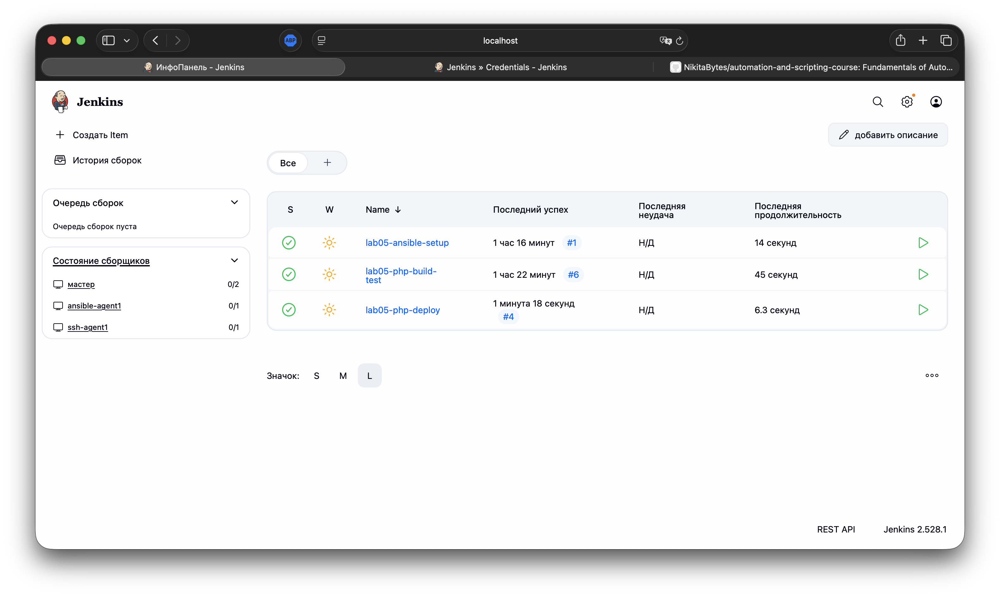

# Лабораторная работа №5

## Автоматизация конфигурации сервера с помощью Ansible и Jenkins (CI/CD для PHP-проекта)

---

### Студент

- **Имя и фамилия:** Савка Никита (Savca Nichita)
- **Группа:** I2302
- **Рабочая станция:** macOS (Apple Silicon, Docker Desktop, VS Code, встроенный терминал)
- **Используемые технологии:** Docker, Docker Compose, Jenkins, Ansible, PHP, Composer, PHPUnit, SSH
- **Дата выполнения:** 2025

---

## Цель

> Научиться создавать Ansible-playbook’и для автоматизации конфигурации серверов
> и интегрировать их в полноценный DevOps-pipeline на базе Jenkins
> (сборка, тестирование и деплой PHP-приложения на тестовый сервер).

---

## Суть задания

Согласно формулировке IW05, необходимо:

1. **Создать каталог lab05** в учебном репозитории и скопировать туда материалы IW04 (lab04 → lab05).
2. **Создать compose.yaml**, в котором описать сервисы:
   - `jenkins-controller` — Jenkins Controller;
   - `ssh-agent` — агент для сборки PHP-проекта и запуска тестов;
   - `ansible-agent` — агент для выполнения Ansible-playbook’ов;
   - `test-server` — тестовый сервер (Ubuntu + SSH), который конфигурируется Ansible.
3. **Настроить Jenkins Controller** и установить плагины: Docker, Docker Pipeline, GitHub Integration, SSH Agent.
4. **Настроить SSH-агент** для сборки PHP-проекта и запуска unit-тестов.
5. **Создать Ansible-агент** на базе Ubuntu с установленным Ansible и SSH.
6. **Создать тестовый сервер** (контейнер) с openssh-server и пользователем ansible, вход по SSH по ключу.
7. **Создать Ansible-playbook’и**:
   - `setup_test_server.yml` — установка Apache2, PHP, модулей, настройка виртуального хоста.
   - `deploy_php.yml` — деплой PHP-проекта на тестовый сервер.
8. **Создать три Jenkins-pipeline’а**:
   - `php_build_and_test_pipeline.groovy` — сборка и тестирование PHP-проекта через SSH-агент;
   - `ansible_setup_pipeline.groovy` — конфигурация тестового сервера через Ansible-агент;
   - `php_deploy_pipeline.groovy` — деплой PHP-проекта на тестовый сервер через Ansible.
9. **Проверить деплой в браузере**, убедиться, что PHP-приложение открывается с тестового сервера.
10. **Подготовить отчёт**, описывающий структуру проекта, шаги настройки и ответы на теоретические вопросы.

---

## Структура проекта

В корне учебного репозитория создана папка `lab05` следующей структуры (логически):

- `lab05/compose.yaml` — Docker Compose со всеми сервисами (Jenkins, агенты, тестовый сервер).
- `lab05/Dockerfile.ssh_agent` — образ SSH-агента с PHP-CLI и Composer.
- `lab05/Dockerfile.ansible_agent` — образ Ansible-агента (Ubuntu + Ansible + SSH + утилиты).
- `lab05/Dockerfile.test_server` — образ тестового сервера (Ubuntu + openssh-server + базовые пакеты).
- `lab05/ansible/`
  - `hosts.ini` — inventory с описанием тестового сервера;
  - `setup_test_server.yml` — playbook для установки Apache2, PHP и настройки виртуального хоста;
  - `deploy_php.yml` — playbook для деплоя PHP-приложения на тестовый сервер.
- `lab05/php-app/`
  - простой PHP-проект с точкой входа `public/index.php`;
  - `composer.json` + `composer.lock`;
  - `tests/` с unit-тестами для запуска через PHPUnit.
- `lab05/pipelines/`
  - `php_build_and_test_pipeline.groovy` — pipeline сборки и тестирования PHP;
  - `ansible_setup_pipeline.groovy` — pipeline Ansible-настройки сервера;
  - `php_deploy_pipeline.groovy` — pipeline деплоя.
- `lab05/secrets/`
  - SSH-ключи для агента Jenkins (`jenkins_agent_ssh_key` и `jenkins_agent_ssh_key.pub`);
  - SSH-ключи для доступа Ansible → test-server.

Репозиторий хранится на GitHub; ветка `lab05` содержит все файлы по работе.

---

## Подготовка инфраструктуры: Docker Compose

### 1. Файл lab05/compose.yaml

Цель: поднять единым `docker compose up` все необходимые компоненты:

- Jenkins контроллер;
- SSH-агент для PHP;
- Ansible-агент;
- Тестовый сервер.

Пример логической конфигурации:

- Сеть `jenkins-network` типа bridge — чтобы контейнеры видели друг друга по именам (ssh-agent, ansible-agent, test-server).
- Volume’ы:
  - `jenkins_home` — для постоянного хранения настроек Jenkins;
  - `jenkins_agent_volume` — рабочая директория агента Jenkins;
  - при необходимости — volume для Ansible-агента.

```bash
cd lab05
docker compose up -d
docker compose ps
```

Ожидание: все сервисы в статусе Up.

---

## Настройка Jenkins Controller

### 2. Запуск и базовая конфигурация Jenkins

После запуска `jenkins-controller` через compose.yaml:

1. Открывается Jenkins по адресу: [`http://localhost:8080`](http://localhost:8080)
2. На первом запуске вводится initial admin password (из логов контейнера).
3. Устанавливаются рекомендуемые плагины.
4. Создаётся администратор admin (логин/пароль).

Дополнительно устанавливаются плагины, требуемые по заданию:

- Docker
- Docker Pipeline
- GitHub Integration
- SSH Agent

Через: Manage Jenkins → Manage Plugins → Available / Installed.

---

## Настройка SSH-агента (PHP-agent)

### 3. Dockerfile для SSH-агента

В `lab05/Dockerfile.ssh_agent` описан образ на базе `jenkins/ssh-agent`, в котором:

- устанавливается PHP-CLI (для запуска php, composer, phpunit),
- при необходимости — git, curl, composer.

Пример логики:

```dockerfile
FROM jenkins/ssh-agent
RUN apt-get update && apt-get install -y php-cli git curl && rm -rf /var/lib/apt/lists/*
```

Агент будет использоваться Jenkins-нодой с label `php-agent`.

### 4. Генерация SSH-ключей и secrets

В корне проекта:

```bash
mkdir -p lab05/secrets
cd lab05/secrets
ssh-keygen -f jenkins_agent_ssh_key
```

- Приватный ключ — `jenkins_agent_ssh_key`
- Публичный — `jenkins_agent_ssh_key.pub`

Публичный ключ монтируется в контейнер агента, а приватный используется Jenkins-кредитами.

### 5. Сервис ssh-agent в compose.yaml

В compose.yaml добавлен сервис:

```yaml
ssh-agent:
  build:
    context: .
    dockerfile: Dockerfile.ssh_agent
  container_name: ssh-agent
  environment:
    JENKINS_AGENT_SSH_PUBKEY: ${JENKINS_AGENT_SSH_PUBKEY} # публичный ключ для авторизации.
  volumes:
    - jenkins_agent_volume:/home/jenkins/agent
  networks:
    - jenkins-network
```

Переменная `JENKINS_AGENT_SSH_PUBKEY` задаётся в `.env` в корне lab05, как строка публичного ключа.

### 6. Подключение агента к Jenkins

В Jenkins:

1. Перейти в Manage Jenkins → Manage Nodes and Clouds → New Node.
2. Создать ноду:
   - Имя: `php-agent`
   - Тип: Permanent Agent
3. Параметры ноды:
   - Remote root directory: `/home/jenkins/agent`
   - Labels: `php-agent`
   - Launch method: Launch agents via SSH
   - Host: `ssh-agent`
   - Credentials: SSH-креды с приватным ключом `jenkins_agent_ssh_key`.
4. После сохранения — убедиться, что нода в статусе Online.

---

## Настройка Ansible-агента

### 7. Dockerfile для Ansible-агента

В `lab05/Dockerfile.ansible_agent` создаётся образ на базе Ubuntu, где устанавливается:

- ansible
- openssh-client
- python3, python3-pip
- git, curl, vim (при необходимости)

### 8. Сервис ansible-agent в compose.yaml

Сервис `ansible-agent`:

```yaml
ansible-agent:
  build:
    context: .
    dockerfile: Dockerfile.ansible_agent
  container_name: ansible-agent
  volumes:
    - рабочая директория агента,
    - каталог с приватными SSH-ключами для ansible.
  networks:
    - jenkins-network
```

Внутри Ansible-агента:

- ключ для Jenkins — чтобы подключаться к нему как к ноде;
- ключ для ansible-пользователя на test-server — для запуска playbook’ов.

### 9. Jenkins-нода ansible-agent

Аналогично `php-agent`, создаётся нода:

- Имя: `ansible-agent`
- Label: `ansible-agent`
- Host: `ansible-agent`
- Remote root directory: например, `/home/ansible/agent` или `/home/jenkins/ansible`
- Метод запуска: SSH с соответствующими credentials.

---

## Тестовый сервер

### 10. Dockerfile тестового сервера

В `lab05/Dockerfile.test_server`:

- Базовый образ: `ubuntu:22.04`.
- Устанавливается:
  - openssh-server
  - базовые утилиты;
- Создаётся пользователь `ansible`;
- Настраивается SSH:
  - включен вход по ключам,
  - публичный ключ ansible размещён в `~ansible/.ssh/authorized_keys`;
- Экспортируется порт 22.

В compose.yaml тестовый сервер:

```yaml
test-server:
  build:
    context: .
    dockerfile: Dockerfile.test_server
  container_name: test-server
  ports:
    - "8088:80" # проброс веб-сервера наружу после настройки Apache
  networks:
    - jenkins-network
```

---

## Ansible: inventory и playbook’и

### 11. Inventory lab05/ansible/hosts.ini

Файл `hosts.ini` описывает доступ к тестовому серверу:

```ini
[test_server]
test-server ansible_host=test-server ansible_user=ansible ansible_ssh_private_key_file=/home/ansible/.ssh/id_rsa
```

- `test-server` — имя сервиса в Docker-сети.
- `ansible_user=ansible` — системный пользователь на тестовом сервере.
- `ansible_ssh_private_key_file` — путь к приватному ключу внутри контейнера Ansible-агента.

### 12. Playbook setup_test_server.yml

Основные задачи playbook’а:

1. Обновление пакетов: `apt update` / `apt upgrade` (через Ansible модуль apt).
2. Установка Apache2: пакет `apache2`.
3. Установка PHP и необходимых расширений: `php`, `libapache2-mod-php`, возможно `php-xml`, `php-mbstring`.
4. Настройка виртуального хоста: создание директории `/var/www/html/project`; копирование базового `index.php`; создание файла vhost’а в `/etc/apache2/sites-available/project.conf` (DocumentRoot `/var/www/html/project`; включение сайта `a2ensite project`).
5. Перезагрузка Apache: `systemctl reload apache2` или `service apache2 reload`.

После выполнения playbook’а тестовый сервер готов принимать деплой приложения.

### 13. Playbook deploy_php.yml

Отвечает за деплой PHP-проекта:

1. Принимает артефакт `artifact.tar.gz` из Jenkins (копируется в `lab05/ansible`).
2. На тестовом сервере: распаковывает архив в `/var/www/html/project`; выставляет права (`www-data:www-data`, 0755); перезапускает Apache.

---

## PHP-проект (lab05/php-app)

Создан минимальный PHP-проект:

- `public/index.php` — простая страница (например, выводит “Hello from lab05 CI/CD” и что-нибудь про хост/дату).
- `composer.json` — подключение `phpunit/phpunit` в dev-зависимости.
- `tests/` — один или несколько тестов, проверяющих простую функцию/класс (для демонстрации успешного тестового прогона).

Этот проект используется во всех трёх pipeline’ах.

---

## Jenkins pipelines

### 14. Pipeline 1 — php_build_and_test_pipeline.groovy

Файл: `lab05/pipelines/php_build_and_test_pipeline.groovy`
Агент: `php-agent`

Основные стадии:

1. Checkout repository: `checkout scm` — Jenkins забирает весь Git-репозиторий (ветку lab05) с GitHub.
2. Install dependencies: переход в `lab05/php-app`; проверка версии PHP (`php -v`); установка Composer; `composer install --no-interaction --no-progress`.
3. Run tests: запуск `vendor/bin/phpunit` в `lab05/php-app`; при отсутствии PHPUnit — аккуратный вывод и завершение с информативным сообщением.

В блоке `post { always { ... } }` пишется сообщение о завершении pipeline.

Результат: после успешного выполнения pipeline гарантирует, что PHP-проект собирается и тесты проходят.

### 15. Pipeline 2 — ansible_setup_pipeline.groovy

Файл: `lab05/pipelines/ansible_setup_pipeline.groovy`
Агент: `ansible-agent`

Стадии:

1. Checkout repository: `checkout scm` — забирается репозиторий с playbook’ами.
2. Run Ansible Playbook: setup_test_server: переход в `lab05/ansible`; вывод содержимого `hosts.ini` (для дебага); `ansible --version` (проверка установленного Ansible); запуск `ansible-playbook -i hosts.ini setup_test_server.yml -vv`.

После выполнения: на тестовом сервере установлен Apache2 + PHP; настроен virtual host под проект; веб-сервер обслуживает папку `/var/www/html/project`.

### 16. Pipeline 3 — php_deploy_pipeline.groovy

Файл: `lab05/pipelines/php_deploy_pipeline.groovy`
Агент: `ansible-agent`

Стадии:

1. Checkout repository: снова `checkout scm`.
2. Build artifact: переход в `lab05/php-app`; упаковка всего проекта в `artifact.tar.gz` (tar.gz-архив).
3. Deploy via Ansible: переход в `lab05/ansible`; копирование артефакта `cp ../php-app/artifact.tar.gz ./artifact.tar.gz`; запуск playbook’а деплоя `ansible-playbook -i hosts.ini deploy_php.yml -vv`.

После успешного выполнения: код PHP-приложения оказывается на тестовом сервере в `/var/www/html/project`; Apache перезагружен; сайт доступен по [`http://localhost:8088`](http://localhost:8088).

---

## Проверка результатов в браузере

После успешного завершения всех трёх pipeline’ов:

1. `lab05-php-build-test` — SUCCESS
2. `lab05-ansible-setup` — SUCCESS
3. `lab05-php-deploy` — SUCCESS

в браузере открывается: [`http://localhost:8088`](http://localhost:8088)

Ожидается: главная страница PHP-приложения (например, “Hello from lab05 CI/CD” или phpinfo()), подтверждающая успешный деплой.

---

## Ответы на теоретические вопросы

### 1. Преимущества использования Ansible для конфигурации серверов

- **Agentless-подход**: На серверах не нужно ставить агент; достаточно SSH и Python. Упрощает администрирование и снижает точки отказа.
- **Декларативность и идемпотентность**: Playbook описывает желаемое состояние. Ansible сам решает, что изменить, а что уже соответствует. Повторный запуск безопасен.
- **Читаемый YAML-формат**: Конфигурация в YAML легко читается и рецензируется.
- **Повторяемость и масштабируемость**: Один playbook можно применить к одному серверу или сотне — через inventory. Уменьшает ручную работу и исключает „человеческий фактор“.
- **Хорошая интеграция с CI/CD**: Ansible легко интегрируется в pipeline’ы Jenkins, GitLab CI, GitHub Actions.
- **Большое количество готовых модулей**: Для большинства задач (пакеты, файлы, сервисы, пользователи, Docker, Kubernetes, cloud-ресурсы) есть готовые модули.

### 2. Какие ещё существуют модули Ansible для управления конфигурацией?

Помимо использованных (apt, service, copy, template, file, unarchive), Ansible предлагает:

- **Управление пакетами и репозиториями**: yum, dnf, zypper, package, apt_repository, yum_repository.
- **Управление пользователями и группами**: user, group, authorized_key.
- **Работа с файлами и директориями**: copy, template, file, lineinfile, blockinfile, synchronize (rsync).
- **Управление сервисами и демонами**: service, systemd, supervisorctl.
- **Работа с веб-серверами и БД**: модули для mysql*\*, postgresql*\*, apache2_module, nginx.
- **Контейнеризация и облака**: docker_container, docker_image, k8s, модули для AWS, Azure, GCP.

Таким образом, Ansible покрывает полный цикл конфигурации инфраструктуры.

### 3. Проблемы при создании playbook’а и как они были решены

В процессе настройки возникли типичные проблемы:

- **Проблемы с SSH-доступом**: Симптом: Ansible не может подключиться (Permission denied). Решение: проверить путь к ключу в `hosts.ini`; выставить права `chmod 600` на ключ; убедиться, что публичный ключ в `~ansible/.ssh/authorized_keys` на тестовом сервере.
- **Несоответствие labels нод в Jenkins**: Симптом: pipeline зависает. Решение: привести label в соответствие в Jenkinsfile и конфигурации ноды.
- **Отсутствие необходимых пакетов в контейнерах**: Симптом: `command not found`. Решение: добавить `apt-get install` в Dockerfile’ы; пересобрать образы.
- **Проблемы с правами и DocumentRoot**: Симптом: HTTP 403/404. Решение: жёстко указать путь `/var/www/html/project`; использовать `unarchive` с `remote_src: yes`; выставить владельца `www-data:www-data`.

Все проблемы устранены, полный цикл (Build & Test, Ansible setup, Deploy) стал успешно выполняться.

---

## Чек-лист проверки

- [x] Docker Compose поднимает все сервисы (jenkins-controller, ssh-agent, ansible-agent, test-server).
- [x] Jenkins настроен с плагинами и нодами (php-agent, ansible-agent) в статусе Online.
- [x] SSH-агент собирает и тестирует PHP-проект (composer install, phpunit).
- [x] Ansible-агент выполняет playbook’и (setup Apache+PHP, deploy артефакта).
- [x] Тестовый сервер конфигурируется и принимает деплой (доступ по SSH, веб-сервер на 8088).
- [x] Pipelines завершаются SUCCESS, сайт открывается в браузере.

---

## Блок для скриншотов

| №   | Описание                                                                | Изображение                                                        |
| --- | ----------------------------------------------------------------------- | ------------------------------------------------------------------ |
| 1   | Вывод `docker compose ps` с запущенными сервисами.                      |      |
| 2   | Jenkins Dashboard с нодами php-agent и ansible-agent в статусе Online.  |         |
| 3   | Настройка pipeline lab05-php-build-test (Git URL, Branch, Script Path). |        |
| 4   | Console Output успешного билда lab05-php-build-test.                    |  |
| 5   | Console Output pipeline lab05-ansible-setup с логами Ansible.           |    |
| 6   | Console Output pipeline lab05-php-deploy с логами упаковки и деплоя.    |        |
| 7   | Скриншот браузера с [`http://localhost:8088`](http://localhost:8088).   |           |

---

## Выводы

1. **Полноценный CI/CD**: Настроен pipeline от сборки и тестирования до деплоя с использованием Jenkins и Ansible.
2. **Автоматизация инфраструктуры**: Ansible-playbook’и обеспечивают декларативную и идемпотентную конфигурацию серверов.
3. **Интеграция технологий**: Docker Compose упрощает локальную разработку, SSH-агенты и ключи обеспечивают безопасность.
4. **Практические навыки**: Работа с Jenkins, Ansible, PHP, Docker — ключевые для DevOps.
5. **Надёжность**: Решены типичные проблемы (SSH, labels, пакеты), что делает систему устойчивой.
