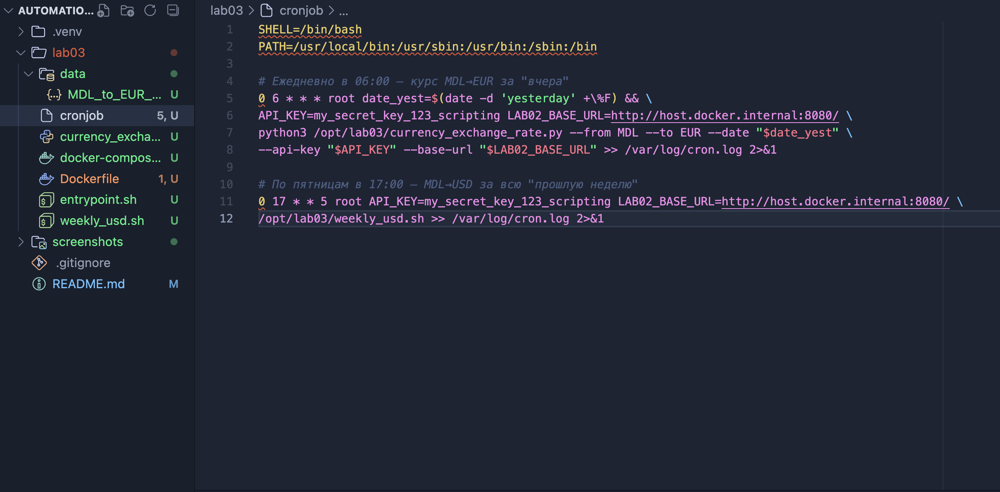
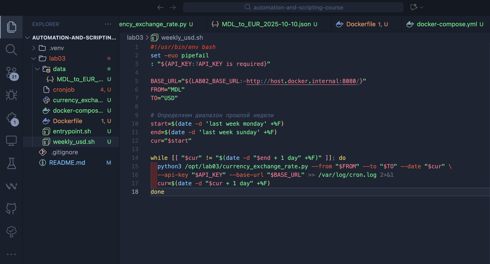
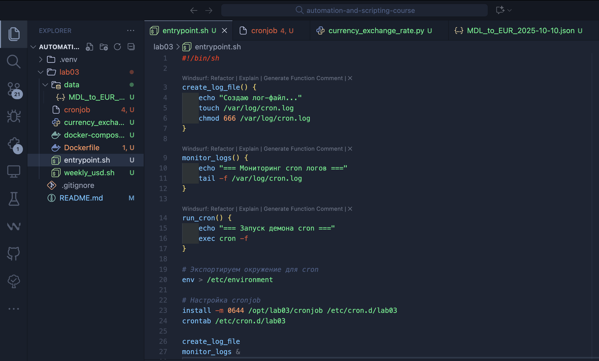
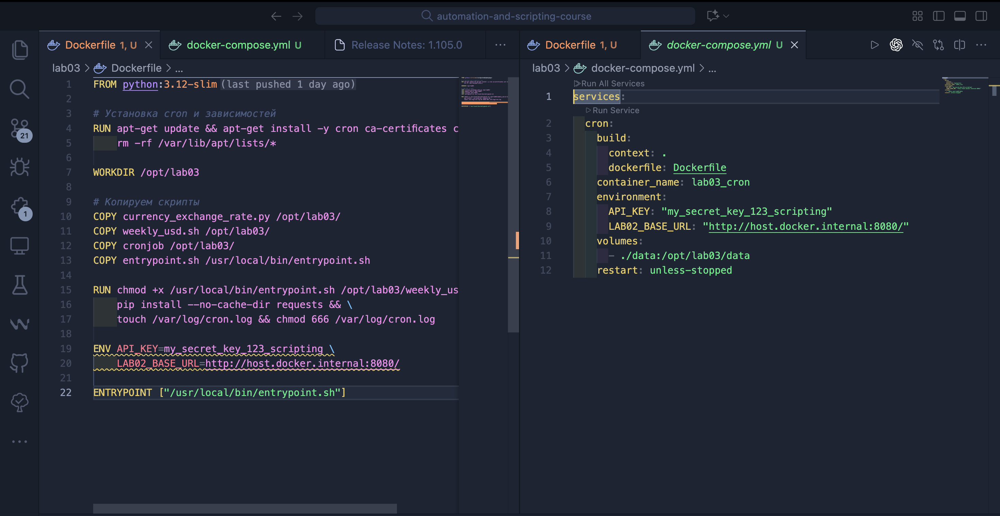
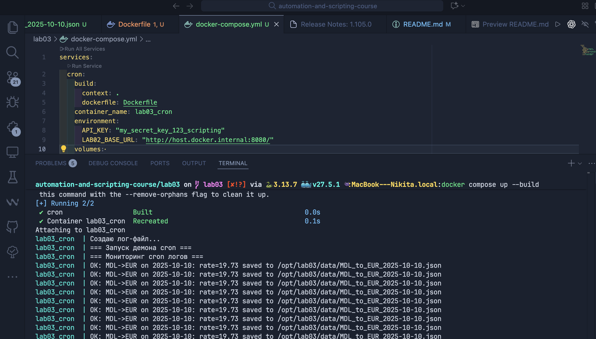
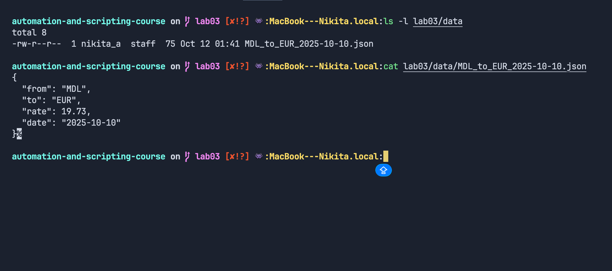

# 🕒 Лабораторная работа №3

## Автоматизация запуска Python-скрипта с помощью планировщика задач (cron)

---

### 👤 Студент

- **Имя и фамилия:** Савка Никита (Savca Nichita)
- **Группа:** I2302
- **Рабочая станция:** macOS (Apple Silicon), VS Code, встроенный терминал
- **Среда исполнения сервиса (API):** Docker на macOS [`http://localhost:8080`](http://localhost:8080)
- **Среда исполнения планировщика:** Docker-контейнер с cron (Debian/Ubuntu, Python 3.12)
- **Дата выполнения:** октябрь 2025

---

## 🎯 Цель

> Настроить автоматический запуск Python-скрипта (из ЛР2) по расписанию с помощью cron:
>
> - **ежедневно в 06:00** — курс MDL→EUR за вчера
> - **еженедельно по пятницам в 17:00** — курс MDL→USD за всю прошлую неделю

---

## 🧩 Суть задания

1. **В учебном репозитории:**
   - создать ветку `lab03`
   - каталог `lab03/`
   - скопировать туда содержимое ЛР2 (`lab02/*`)
2. **В `lab03/` подготовить:**
   - `cronjob` — расписание задач cron
   - `weekly_usd.sh` — сбор данных за прошлую неделю
   - `entrypoint.sh` — запуск cron и мониторинг логов
   - `Dockerfile` — образ (Python + cron + зависимости + скрипты)
   - `docker-compose.yml` — сборка/запуск контейнера
3. **Логи cron** — в `/var/log/cron.log`; **данные** — в `/opt/lab03/data` (маппинг на хост)
4. **Краткое `readme.md`** — как собрать, запустить, проверить логи и результаты

---

## 🏗️ Инфраструктура и роли

| Компонент            | Роль                                                                                     |
| -------------------- | ---------------------------------------------------------------------------------------- |
| API-сервис (ЛР2)     | Отдаёт JSON c курсами валют (POST: key, GET: from, to, date). Запущен в Docker на хосте. |
| Скрипт клиента (ЛР2) | `currency_exchange_rate.py` — запрашивает курс, сохраняет JSON, логирует ошибки.         |
| Планировщик (ЛР3)    | Docker-контейнер с cron, ежедневно/еженедельно запускает клиентский скрипт.              |

---

## 🧱 Подготовка репозитория

```bash
git checkout -b lab03
mkdir -p lab03
cp -R lab02/* lab03/
```

> Ветка `lab03` изолирует работу; содержимое ЛР2 переносим в `lab03/`, чтобы докеризация и cron не затрагивали ЛР2.

---

## 🗓️ Cron-расписание (`lab03/cronjob`)

```cron
SHELL=/bin/bash
PATH=/usr/local/bin:/usr/sbin:/usr/bin:/sbin:/bin

# Ежедневно в 06:00 — курс MDL→EUR за "вчера"
0 6 * * * root date_yest=$(date -d 'yesterday' +\%F) && \
API_KEY=my_secret_key_123_scripting LAB02_BASE_URL=http://host.docker.internal:8080/ \
python3 /opt/lab03/currency_exchange_rate.py --from MDL --to EUR --date "$date_yest" \
--api-key "$API_KEY" --base-url "$LAB02_BASE_URL" >> /var/log/cron.log 2>&1

# По пятницам в 17:00 — MDL→USD за всю "прошлую неделю"
0 17 * * 5 root API_KEY=my_secret_key_123_scripting LAB02_BASE_URL=http://host.docker.internal:8080/ \
/opt/lab03/weekly_usd.sh >> /var/log/cron.log 2>&1
```

> - `\%F` — экранирование `%` в crontab обязательно!
> - `host.docker.internal` — доступ из контейнера к сервису на хосте (Docker Desktop).
> - Все задачи пишут вывод в `/var/log/cron.log`.

---

## 📆 Еженедельный сбор (`lab03/weekly_usd.sh`)

```bash
#!/usr/bin/env bash
set -euo pipefail
: "${API_KEY:?API_KEY is required}"

BASE_URL="${LAB02_BASE_URL:-http://host.docker.internal:8080/}"
FROM="MDL"
TO="USD"

start=$(date -d 'last week monday' +%F)
end=$(date -d 'last week sunday' +%F)
cur="$start"

while [[ "$cur" != "$(date -d "$end + 1 day" +%F)" ]]; do
  python3 /opt/lab03/currency_exchange_rate.py --from "$FROM" --to "$TO" --date "$cur" \
    --api-key "$API_KEY" --base-url "$BASE_URL" >> /var/log/cron.log 2>&1
  cur=$(date -d "$cur + 1 day" +%F)
done
```

> Скрипт вычисляет «прошлую» неделю и для каждого дня вызывает клиент ЛР2, складывая результаты в общую папку данных.

---

## 🚀 Entrypoint (`lab03/entrypoint.sh`)

```bash
#!/bin/sh

create_log_file() {
  echo "Создаю лог-файл..."
  touch /var/log/cron.log
  chmod 666 /var/log/cron.log
}

monitor_logs() {
  echo "=== Мониторинг cron логов ==="
  tail -f /var/log/cron.log
}

run_cron() {
  echo "=== Запуск демона cron ==="
  exec cron -f
}

# Экспорт окружения для cron
env > /etc/environment

# Подключаем расписание
install -m 0644 /opt/lab03/cronjob /etc/cron.d/lab03
crontab /etc/cron.d/lab03

create_log_file
monitor_logs &
run_cron
```

> - `cron -f` — foreground-режим (для контейнера)
> - `tail -f` — поток логов виден прямо в `docker compose up`

---

## 🧱 Dockerfile (`lab03/Dockerfile`)

```dockerfile
FROM python:3.12-slim

RUN apt-get update && apt-get install -y --no-install-recommends \
  cron ca-certificates curl tzdata && \
  rm -rf /var/lib/apt/lists/*

WORKDIR /opt/lab03

COPY currency_exchange_rate.py /opt/lab03/
COPY weekly_usd.sh /opt/lab03/
COPY cronjob /opt/lab03/
COPY entrypoint.sh /usr/local/bin/entrypoint.sh

RUN chmod +x /usr/local/bin/entrypoint.sh /opt/lab03/weekly_usd.sh && \
  pip install --no-cache-dir requests && \
  mkdir -p /opt/lab03/data && \
  touch /var/log/cron.log && chmod 666 /var/log/cron.log

ENV API_KEY=my_secret_key_123_scripting \
    LAB02_BASE_URL=http://host.docker.internal:8080/ \
    TZ=Europe/Chisinau

ENTRYPOINT ["/usr/local/bin/entrypoint.sh"]
```

> - Установлен `tzdata` — cron работает в вашем часовом поясе.
> - Данные сохраняются в `/opt/lab03/data` (маппинг на хост).

---

## ⚙️ docker-compose (`lab03/docker-compose.yml`)

```yaml
services:
  cron:
    build:
      context: .
      dockerfile: Dockerfile
    container_name: lab03_cron
    environment:
      API_KEY: "my_secret_key_123_scripting"
      LAB02_BASE_URL: "http://host.docker.internal:8080/"
      TZ: "Europe/Chisinau"
    volumes:
      - ./data:/opt/lab03/data
    restart: unless-stopped
```

> - Том `./data:/opt/lab03/data` — чтобы видеть JSON-файлы на хосте.
> - Время cron синхронизировано через `TZ`.

---

## ▶️ Запуск

```bash
cd lab03
docker compose up --build
```

**Ожидаемые строки в консоли:**

```
Создаю лог-файл...
=== Запуск демона cron ===
=== Мониторинг cron логов ===
```

---

## 📝 Проверка логов и результатов

- **Логи cron:**
  ```bash
  docker exec -it lab03_cron bash -lc 'tail -n 100 /var/log/cron.log'
  ```
- **Артефакты:**
  ```bash
  ls -l lab03/data
  cat lab03/data/MDL_to_EUR_2025-10-10.json
  ```

---

## ✅ Ожидаемый вывод

```
OK: MDL->EUR on 2025-10-10: rate=19.73 saved to /opt/lab03/data/MDL_to_EUR_2025-10-10.json
```

**Пример содержимого JSON:**

```json
{
	"from": "MDL",
	"to": "EUR",
	"rate": 19.73,
	"date": "2025-10-10"
}
```

---

## 🔎 Важные нюансы

- **host ↔ контейнер:** `LAB02_BASE_URL=http://host.docker.internal:8080/`
- **ENV для cron:** `env > /etc/environment` в entrypoint.sh
- **Экранирование %:** в crontab — только `\%`
- **Часовой пояс:** `TZ=Europe/Chisinau`
- **Путь данных:** `/opt/lab03/data` (маппинг на хост)
- **Логи:** `/var/log/cron.log` — для диагностики
- **Надёжность:** `set -euo pipefail` в weekly_usd.sh, явные коды ошибок Python-скрипта

---

## 🧪 Чек-лист проверки

- [x] Ежедневная задача формирует 1 JSON за вчера (MDL→EUR)
- [x] Еженедельная — 7 JSON-файлов за прошлую неделю (MDL→USD)
- [x] Все файлы появляются в `lab03/data/` (на хосте)
- [x] Ошибки протоколируются в `/var/log/cron.log`
- [x] Проверка через `docker exec` и просмотр файлов

---

## 🖼️ Блок с скриншотами

|   № | Описание                                                                        | Скриншот                                                                            |
| --: | ------------------------------------------------------------------------------- | ----------------------------------------------------------------------------------- |
|   1 | Дерево проекта в VS Code (ветка `lab03`, папка `lab03/`, файлы)                 |  `screenshots/shot_tree.png`                      |
|   2 | Открытый `cronjob` (две задачи: 06:00 и пятница 17:00, экранированные `%`)      |  `screenshots/shot_cronjob.png`             |
|   3 | Открытый `weekly_usd.sh` (цикл дат прошлой недели)                              |  `screenshots/shot_weekly.png`                |
|   4 | Открытый `entrypoint.sh` (создание лога, export env, запуск cron/tail)          |  `screenshots/shot_entrypoint.png`    |
|   5 | `Dockerfile` и `docker-compose.yml` в редакторе                                 |  `screenshots/shot_dockerfiles.png` |
|   6 | Консоль `docker compose up --build` (видно “Создаю лог-файл…”, cron, tail)      |  `screenshots/shot_up.png`                            |
|   7 | `ls -l lab03/data` и `cat` одного из JSON — подтверждение наличия и содержимого |  `screenshots/shot_data_json.png`       |

## 🧠 Выводы

1. Настроен автоматический сбор курсов валют по расписанию: ежедневный MDL→EUR (за вчера) и еженедельный MDL→USD (за прошлую неделю).
2. Реализована контейнеризация планировщика: reproducible-окружение (Python + cron), единый лог, контролируемые ENV, корректный доступ к API на хосте.
3. Результаты сохраняются на хост (том `lab03/data`), что упрощает проверку.
4. Соблюдены практики продакшн-качества: явная конфигурация TZ, экранирование %, централизованное логирование, автономность задач.
